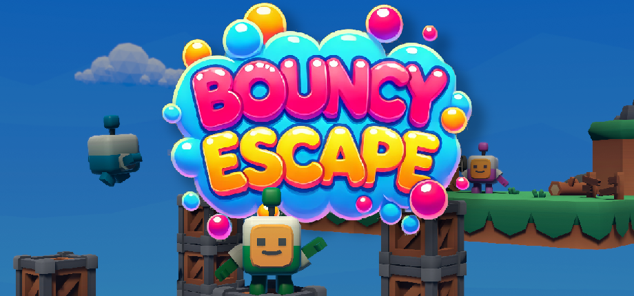
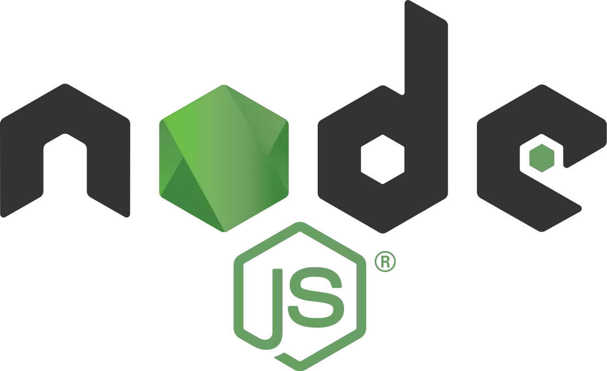
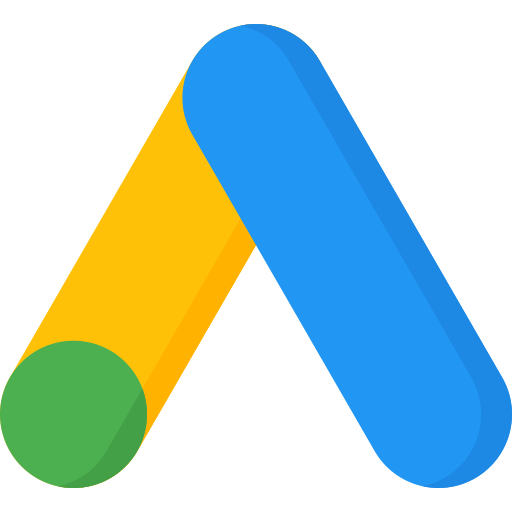

<!DOCTYPE html>
<html lang="pl">
<head>
    <meta charset="UTF-8">
    <meta name="viewport" content="width=device-width, initial-scale=1.0">
    <title>Moje Portfolio - Projekt</title>
    
</head>
<body>
    

        <h1>O mnie</h1>
        
Jestem doświadczonym twórcą gier i programistą, który prowadził projekty od A do Z. Mam doświadczenie w programowaniu, marketingu i zarządzaniu projektami.

    

    
    

        <h1>Bouncy Escape</h1>
        
Bouncy Escape to dynamiczna gra platformowa 3D z trybem wieloosobowym. Oferuje różne tryby gry, personalizację postaci i intensywną rozgrywkę.

        
        
Więcej informacji oraz kod źródłowy znajdziesz tutaj:

        <a href="https://store.steampowered.com/app/3256880/Bouncy_Escape/" class="btn" target="_blank">Zobacz na Steam</a>
    

    
    

        <h1>Narzędzia i doświadczenie</h1>
        
Pracowałem z wieloma technologiami i narzędziami:

        

            

                
                Unity Engine
            

            

                
                Firebase
            

            

                
                VS Code
            

            

                
                NodeJS
            

            

                
                Google Ads
            

        

    

</body>
</html>
